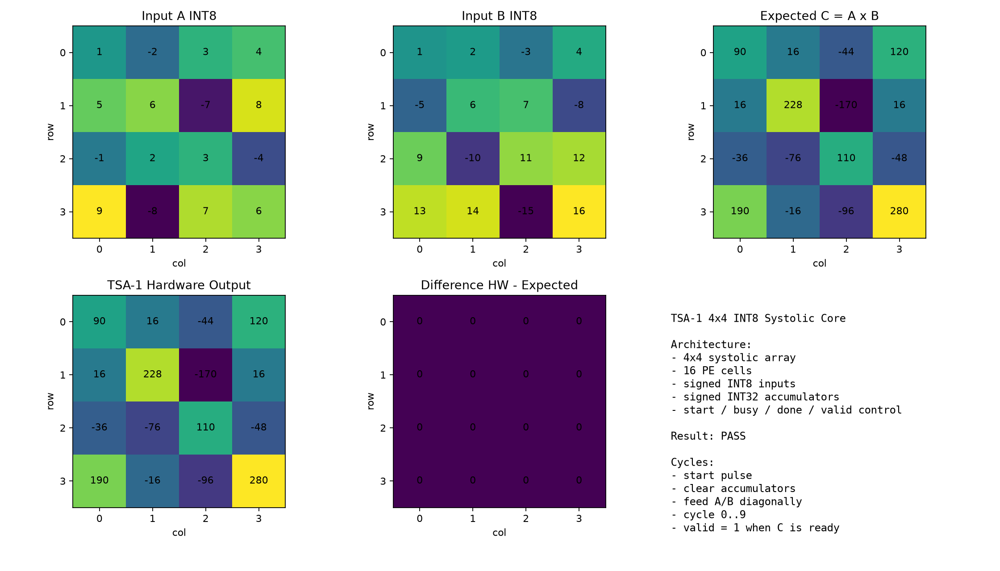
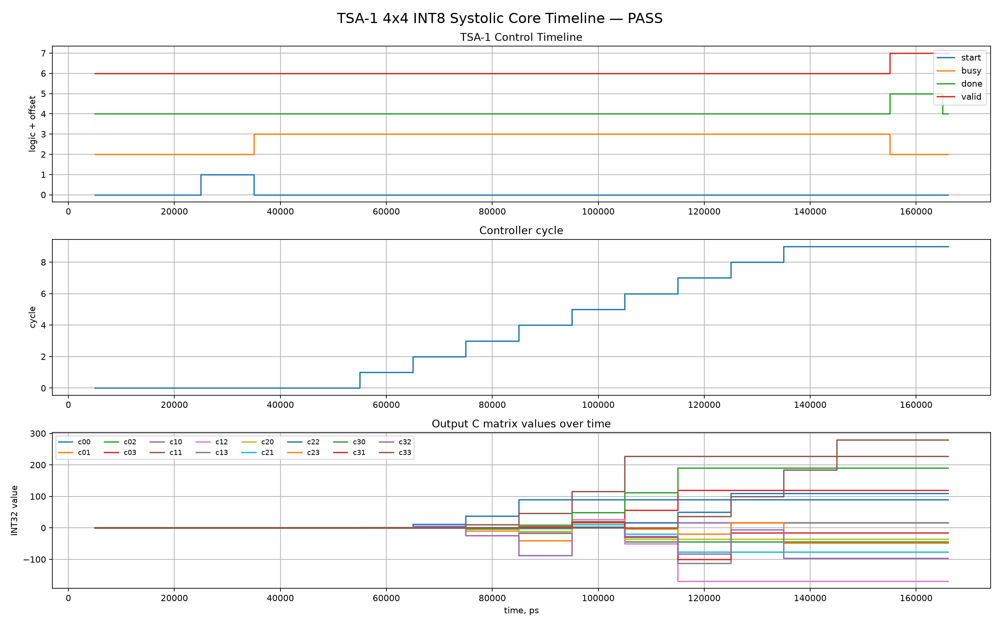

# TSA — Tiny Systolic Accelerator

**TSA** is an experimental INT8 systolic AI accelerator IP-core written in Verilog/SystemVerilog.

The project demonstrates a complete learning path from a single MAC unit to a synthesis-valid AXI-Lite compatible matrix accelerator.

## Current Status

TSA currently includes two accelerator generations:

| Core  | Matrix Tile | PE Count | Input       | Accumulator  | Interface       | Status |
| ----- | ----------: | -------: | ----------- | ------------ | --------------- | ------ |
| TSA-1 | 4x4         | 16 PE    | signed INT8 | signed INT32 | MMIO + AXI-Lite | PASS   |
| TSA-2 | 8x8         | 64 PE    | signed INT8 | signed INT32 | AXI-Lite        | PASS   |

## Visual Reports

Matrix verification — hardware output vs NumPy reference, difference = 0:

Execution timeline — control signals and C accumulation over cycles:

## Architecture

TSA uses an **output-stationary systolic array**.

Dataflow:
- Matrix A flows horizontally.
- Matrix B flows vertically.
- Partial sums stay inside each PE accumulator.
- Each PE performs INT8 × INT8 → INT32 accumulation.

PE operation:
acc = acc + (a_in * b_in)

## TSA-1

TSA-1 is a 4x4 INT8 systolic accelerator.

Features:
- 16 processing elements
- Signed INT8 inputs
- Signed INT32 accumulators
- Output-stationary dataflow
- Simple local-memory / MMIO top
- AXI-Lite compatible top
- Stable `done_latched` / `valid_latched` / `irq` status
- W1C `clear_done` behavior
- 50 random verification tests
- Visual matrix report
- Timeline report

## TSA-2

TSA-2 is an 8x8 INT8 systolic accelerator.

Features:
- 64 processing elements
- Signed INT8 inputs
- Signed INT32 accumulators
- Output-stationary dataflow
- AXI-Lite compatible host interface
- Local A / B input buffers
- C output buffer
- Stable start / busy / done / valid / irq control path
- W1C `clear_done` behavior
- 30 random verification tests
- Xilinx 7-series synthesis mapping through Yosys

## Host Interface

The AXI-Lite wrapper exposes a register-style control interface:

| Register | Description                               |
| -------- | ----------------------------------------- |
| CTRL     | start / clear_done                        |
| STATUS   | busy / done_latched / valid_latched / irq |
| A buffer | input matrix A                            |
| B buffer | input matrix B                            |
| C buffer | output matrix C                           |

Host flow:

1. Write matrix A.
2. Write matrix B.
3. Write `CTRL.start`.
4. Poll `STATUS.done_latched`.
5. Read matrix C.
6. Compare against reference output.
7. Clear done / irq using W1C `clear_done`.

## Verification

TSA is verified using Verilog/SystemVerilog testbenches and Python reference checks.

Current verification status:

| Test                              | Result      |
| --------------------------------- | ----------- |
| TSA-1 4x4 core test               | PASS        |
| TSA-1 local memory / MMIO test    | PASS        |
| TSA-1 AXI-Lite test               | PASS        |
| TSA-1 random verification         | 50 / 50 PASS |
| TSA-2 8x8 core test               | PASS        |
| TSA-2 AXI-Lite test               | PASS        |
| TSA-2 random verification         | 30 / 30 PASS |
| Full card-style accelerator test  | PASS        |

Run full test suite:
make cardtest

Run TSA-2 AXI-Lite test only:
make axi8x8

Run Xilinx synthesis mapping:
make synth-xilinx

## Synthesis

TSA-2 AXI-Lite 8x8 has been mapped using Yosys `synth_xilinx` for Xilinx 7-series.

Current synthesis mapping summary:

| Resource    | Count |
| ----------- | ----: |
| DSP48E1     | 64    |
| Total cells | 15544 |
| LUT1        | 7     |
| LUT2        | 84    |
| LUT3        | 174   |
| LUT4        | 3100  |
| LUT5        | 142   |
| LUT6        | 1381  |
| Warnings    | 7 non-critical memory-to-register |

Important synthesis notes:
- Each PE maps to one DSP48E1 hardware multiplier.
- No fatal synthesis errors were reported.
- No actual latch inference was observed.
- Current report is Yosys / Xilinx mapping, not full Vivado place-and-route.
- Fmax, timing closure, and power estimates require a real FPGA flow.

## Generated Reports

Generated files include:

- `reports/tsa_4x4_report.png`
- `reports/tsa_4x4_timeline.png`
- `reports/tsa_8x8_report.png`
- `reports/tsa_fpga_mem_timeline.csv`
- `reports/tsa_axi_lite_timeline.csv`
- `reports/synth/tsa2_axi8_xilinx_xc7.log`

## Project Direction

TSA is a compact FPGA/ASIC learning project and a portfolio-grade AI accelerator IP-core prototype.

Roadmap:

- [x] TSA-1 4x4 output-stationary systolic core
- [x] TSA-1 AXI-Lite compatible IP-core
- [x] TSA-2 8x8 output-stationary systolic core
- [x] TSA-2 AXI-Lite compatible IP-core
- [x] Random verification against NumPy reference
- [x] Yosys `synth_xilinx` mapping (DSP48E1 confirmed)
- [ ] Vivado synthesis for a concrete Zynq target
- [ ] FPGA utilization and Fmax report
- [ ] PYNQ / Zynq Python driver
- [ ] Real FPGA board demo
- [ ] TSA-3 tiled GEMM engine
- [ ] INT8 MNIST inference demo

## What TSA is NOT

- Not a GPU replacement.
- Not a production silicon design.
- Not a full ASIC flow (no place-and-route, no timing closure yet).
- Not a claim of competing with NVIDIA / AMD / Google TPU.

TSA is a learning-grade, honestly-scoped RTL project meant to demonstrate systolic array design, AXI-Lite integration, and synthesis discipline.

## License

Apache-2.0. See [LICENSE](LICENSE).
